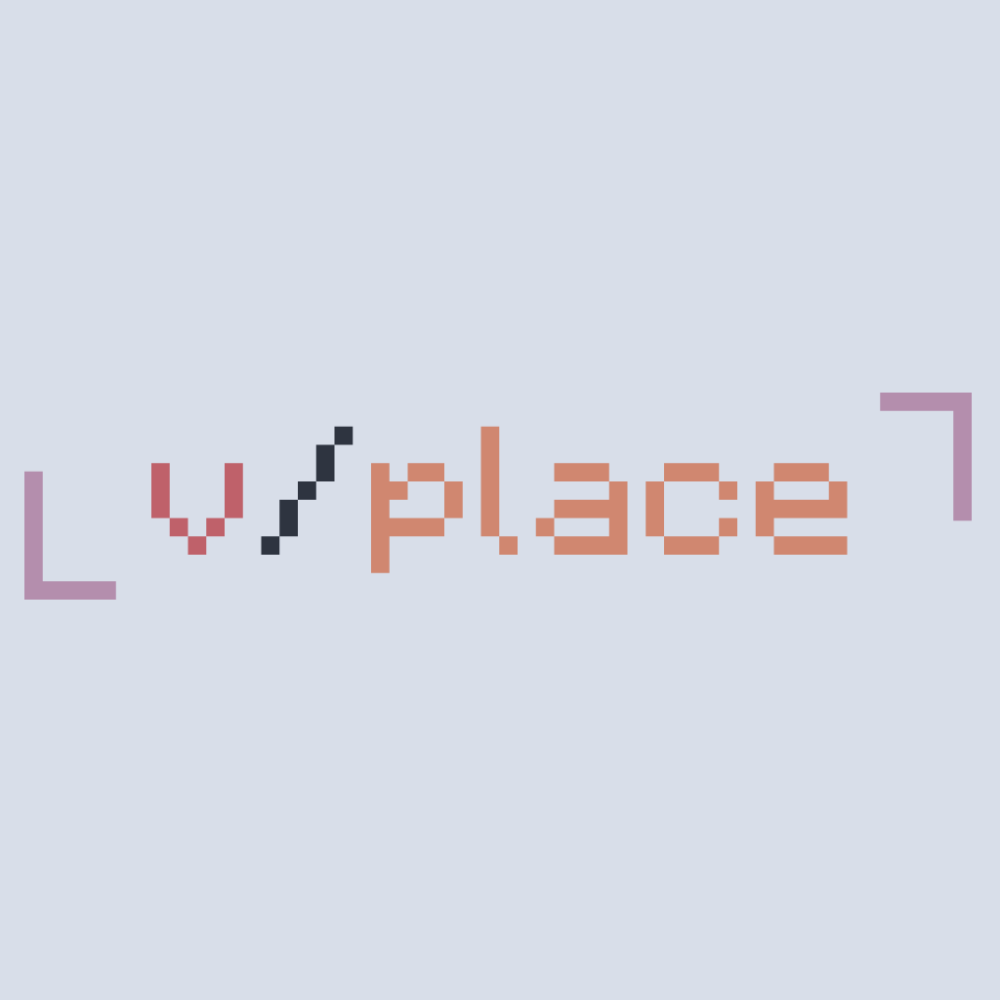

# v-place

<b>v/place is a digital canvas where users can collaborate to create pixel art heavily inspired by [r/place]().</b>




## Features

- Real Time Per Pixel Update Info 
- 16 color support
- cooldown validation    
- ablity to update cooldown and canvas dimension.
- REST Api build using [actix-web](https://actix.rs/)
- realtime canvas update based on websockets.
- [Redis](https://redis.io/) bitfild for storing canvas data (4bits/pixel).
- Pixel Updates are stored on [Scylladb](https://www.scylladb.com/)


## Installation

To install and run the v-place api, follow the steps below:

1. Clone the repository:

    ```
    git clone https://github.com/v4zha/v-place
    ```

2. Navigate to the project directory:

    ```
    cd v-place
    ```

3. rename the `sample.env` to `.env` file in the project root directory and set the required environment variables. For example:

    ```bash
    HOST=0.0.0.0
    PORT=8080
    REDIS_URL= "redis://redis:6379"
    SCYLLA_URL="scylla:9042"
    CANVAS_DIM=500 #Square canvas (dim * dim)
    CANVAS_ID=vplace_1
    COOLDOWN=30 #cooldown in seconds
    ```
4. run docker contrainer using docker compose
    ```
    docker compose up
    ```

## Todos
- v-place UI
- user Auth and Validation
- log all updates
